# Watermelon Globe

🍉🌍 Your ultimate trip planner with a twist! Whether you're dreaming of sandy beaches or snowy peaks, we'll slice through the planning chaos and serve up your perfect itinerary—refreshing, sweet, and oh-so-juicy! Travel planning has never been this fruitful. 🚀✈

## Motivation

Because we had to. No, seriously. This project is the product of a group of ambitious students and the phrase: "It’s obligatory." We didn’t just wake up one day and say, “Hey, let’s build a virtual trip planner and name it after a fruit!”

But hey, when life hands you projects, you make… Watermelon Globe 🍉🌍. Our motivation? Passing the course, proving our worth as developers under pressure, and sprinkling in some humor to keep our sanity intact(quite literally).

So, while we didn’t exactly choose this journey, we’ve poured our hearts, souls, and countless late-night debugging sessions into creating something useful, fun, and slightly quirky. Enjoy the fruits of our labor (badum-tshh🥁). 

## Table of Contents

- [Build Status](#Build-Status)
- [Code Style](#Code-Style)
- [Website Screenshots](#Website-Screenshots)
- [Features](#Features)
- [Color References](#Color-Reference)
- [Usage/Examples](#Usage/Examples)
- [Installation](#Installation)
- [API References](#API-References)
- [Test Routes](#Test-Routes)
- [How to use](#How-to-use)
- [Contribute](#Contribute)
- [Credits](#Credits)
- [License](#license)
## Build Status

The project is fully functional for all user roles, including admins, tourists, governors, tour guides, advertisers, etc. However, a few minor bugs may be encountered. Below is an overview of these issues and their respective solutions:

### Known Issues and Solutions

1. *Hotels Availability*

   - *Bug*: Hotels currently include only one option (JW Marriott).
   - *Solution*: More hotels will be added soon!

2. *Currency Exchange Rate*

   - *Bug*: EGP exchange rate was added manually as the API doesn’t provide it.
   - *Solution*: Make sure to include the manually added rate in any code involving currency changes.

3. *Empty Checkout Page*

   - *Bug*: If the user reaches the checkout page before the shopping cart page, the checkout will be empty.
   - *Solution: Ensure the proper sequence: **Choose products → Add to cart → Proceed to checkout*.

4. *Hotel Booking with Past Dates*

   - *Bug*: An error occurs when booking hotels with a past date (expected behavior).
   - *Solution*: Always choose a present or future date to avoid errors.

5. *Filtering Activities and Itineraries*

   - *Bug*: The "amount" field always uses Americans dollars, even if a different currency is selected.
   - *Solution*: Use USD for filtering, and then change the currency after filtering to display prices in the chosen currency.

6.*products page bug*

   -*Issue*: The navigation bar in the products page is not functioning properly (currency change is not working)
### Summary

While the system is operational and supports all core functionalities, addressing these issues will further enhance the user experience. Stay tuned for updates!

## Code Style

No strict code style was used in the project,however, all of the developers used visual studio code as their IDE, github as the source control system and a unified mongo database between each other.

- 
- 
- 

## Website Screenshots

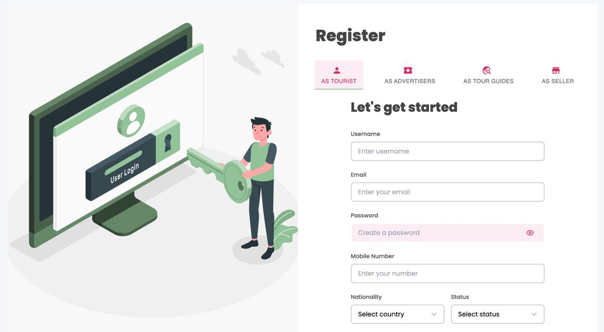

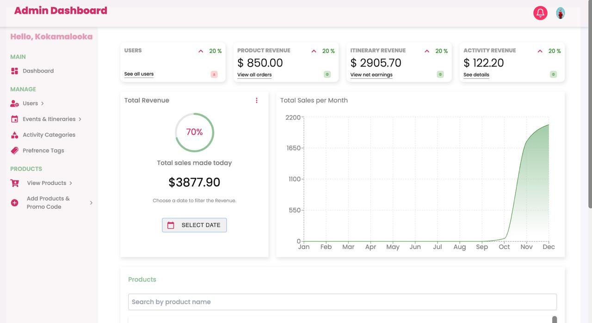

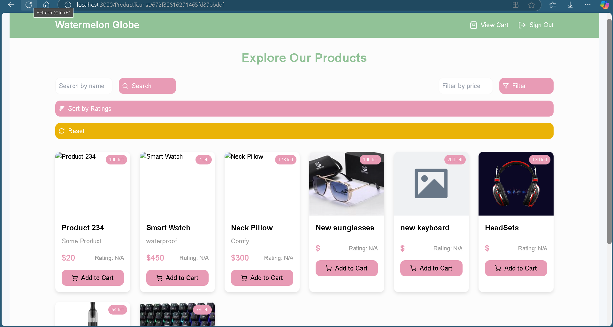

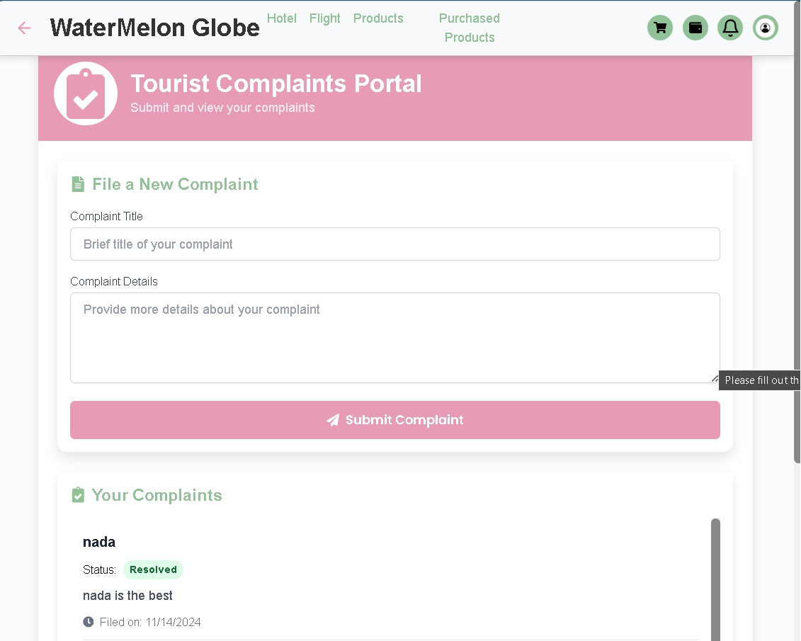

## Tech/Framework used

Here are the technologies and frameworks used in this project, along with links to download or learn more about them:

- [*VS Code*](https://code.visualstudio.com/download): A powerful and lightweight code editor.  
  Choose the version that suits your OS.  
  

- [*Node.js*](https://nodejs.org/): A JavaScript runtime for building scalable applications.  
  

- [*Nodemon*](https://www.npmjs.com/package/nodemon): A tool to automatically restart the server after code changes.

- [*Express*](https://www.npmjs.com/package/express): A web application framework for Node.js.  
  

- [*Mongoose*](https://www.npmjs.com/package/mongoose): An ODM library for MongoDB and Node.js.  
  

- [*React*](https://react.dev/): A JavaScript library for building user interfaces.  
  

- [*Git*](https://git-scm.com/): A version control system to track code changes.  
  

- [*Axios*](https://www.npmjs.com/package/axios): A promise-based HTTP client for the browser and Node.js.  
  

- [*MongoDB Atlas*](https://www.mongodb.com/atlas/database): A fully managed cloud database.  
  

- [*Postman*](https://www.postman.com/downloads/): A platform for API development and testing.  
  Choose the version that suits your OS.  
  

## Features

Our app is designed to provide an exceptional travel experience by integrating comprehensive functional and non-functional capabilities:

- *User Authentication*:
  - Login using username and password for all user types (Tourist, Tour Guide, Advertiser, Seller, Tourism Governor).
  - Password management: Change or reset passwords using an OTP sent to the registered email.
  - Registration: Sign up as a Tourist, Tour Guide, Advertiser, or Seller with detailed user profiles.

- *Customized Travel Planning*:
  - Plan trips based on preferences, including historic sites, beaches, shopping, and budget-conscious options.
  - Create, update, and view personalized itineraries with detailed activity suggestions.

- *Booking & Management*:
  - Secure bookings for flights, hotels, transportation, and activities directly within the app.
  - Activity bookings include child itineraries and are tracked as "completed" for future ratings.
  
- *Smart Budget Management*:
  - Suggestions for activities and transport fitting your remaining budget.
  - Cost estimates for itineraries with dynamic updates.

- *Explore Local Treasures*:
  - Discover curated activities, museums, and historical landmarks with pricing and directions.
  - Access detailed descriptions and user reviews for tourism sites.

- *Interactive Ratings & Feedback*:
  - Rate and comment on itineraries, tour guides, and completed activities.
  - Submit reviews to enhance the travel experience for others.

- *Notifications*:
  - Instant alerts for upcoming bookings, special offers, and itinerary updates.

- *Marketplace*:
  - In-app gift shop with souvenirs and local items.
  - Product search with advanced filtering and sorting options.

- *User Experience*:
  - Intuitive and consistent interface design.
  - Learnability: Simple navigation and clear feedback on user actions.

- *Performance*:
  - High responsiveness with minimal load times.
  - Scalable architecture to handle high traffic volumes.

- *Reliability*:
  - Secure data storage and seamless session management.
  - Backup and recovery systems to prevent data loss.

- *Accessibility*:
  - Compatibility across devices and platforms.
  - Support for multilingual interfaces.

Whether you’re organizing your next escape or uncovering hidden gems during your travels, our app has everything you need to make your journey unforgettable. Begin your adventure today and experience the world like never before!

## Color Reference

| Color               | Hex                                                                 | Comments                                          |
| ------------------- | ------------------------------------------------------------------- | ------------------------------------------------ |
| Primary             |  #e89bb5   | Used for buttons and links (PINK)               |
| Hover               |  #f0a8bf   | Hover color for buttons (PINK HOVER)            |
| Secondary           |  #91c297   | Used for header and main text (GREEN)           |
| Secondary Hover     |  #a4d3a9   | Hover color for secondary elements (GREEN HOVER)|
| Dark Pink           |  #d32e65   | Used for emphasis or danger elements (DARK PINK)|
| Dark Pink Hover     |  #e63b73   | Hover color for dark pink elements              |
| Background          |  #FCFCFC   | Background color for the main page              |
| Section Background  |  #F6F6F6   | Background color for sections                   |
| Card Background     |  #FFFFFF   | Background color for cards                      |

## Usage/Examples

These are some of the major and crucial code examples that sums the key features of the projects aim and purpose

### 1. Handle Booking Logic for an Itinerary
typescript
// Function to handle booking logic for an itinerary
const handleBooking = async (e: React.FormEvent) => {
  // Prevent the default form submission behavior
  e.preventDefault();

  // Check if payment method and itinerary are selected; prompt the user if not
  if (!paymentMethod || !itinerary) {
    alert('Please select a payment method before booking.');
    return;
  }

  // Check if a date and time are selected; prompt the user if not
  if (!selectedDate || !selectedTime) {
    alert('Please select a date and time.');
    return;
  }

  // Indicate that booking is in progress and reset any previous error state
  setBookingInProgress(true);
  setError(null);

  try {
    // Handle wallet payment option
    if (paymentMethod === 'wallet') {
      const walletResponse = await axios.put(`/api/Tourist/updateWallet/${id}`, {
        amount: -itinerary.priceOfTour,
      });

      if (walletResponse.data.wallet >= 0) {
        alert('Payment confirmed using Wallet!');

        await axios.post('/api/TouristItinerary/createChildItinerary', {
          itinerary: tripid,
          buyer: id,
          chosenDates: [selectedDate],
          chosenTimes: [selectedTime],
          totalPrice: itinerary.priceOfTour,
          status: 'pending',
        });

        await axios.put(`/api/Tourist/updateLoyaltyPoints/${id}`, {
          amountPaid: itinerary.priceOfTour,
        });

        alert('Itinerary booked successfully!');
      } else {
        await axios.put(`/api/Tourist/updateWallet/${id}`, {
          amount: +itinerary.priceOfTour,
        });
        alert('Insufficient wallet balance.');
      }
    } else if (paymentMethod === 'creditCard') {
      alert('Proceeding with credit card payment (Stripe)...');

      await axios.post('/api/TouristItinerary/createChildItinerary', {
        itinerary: tripid,
        buyer: id,
        chosenDates: [selectedDate],
        chosenTimes: [selectedTime],
        totalPrice: itinerary.priceOfTour,
        status: 'pending',
      });

      await axios.put(`/api/Tourist/updateLoyaltyPoints/${id}`, {
        amountPaid: itinerary.priceOfTour,
      });

      alert('Itinerary booked successfully!');
    }
  } catch (err) {
    console.error('Error during booking:', err);
    alert('An error occurred while processing the booking. Please try again later.');
  } finally {
    setBookingInProgress(false);
  }
};

### How it works:
 - Validates input fields like payment method, itinerary selection, date, and time, and prompts the user if any are missing.
 - Processes the payment using either the wallet or a credit card (Stripe).
 - If successful, creates a child itinerary and updates loyalty points.
 - Handles errors gracefully and resets the booking state.

### Usage:
Include this in your component to be able to book an itinerary

---
### 2. Handle Flights' Booking
typescript
const handlePaymentAndBooking = async (e: React.FormEvent) => {
    e.preventDefault();

    try {
      const bookingResponse = await axios.post(`/api/Tourist/bookFlight/${touristId}`, {
        airline: flight.validatingAirlineCodes[0],
        flightNumber1: flight.itineraries[0]?.segments[0]?.carrierCode + flight.itineraries[0]?.segments[0]?.number,
        departure1: flight.itineraries[0]?.segments[0]?.departure?.at,
        arrival1: flight.itineraries[0]?.segments[0]?.arrival?.at,
        flightNumber2: flight.itineraries[0]?.segments[1]?.carrierCode + flight.itineraries[0]?.segments[1]?.number,
        departure2: flight.itineraries[0]?.segments[1]?.departure?.at,
        arrival2: flight.itineraries[0]?.segments[1]?.arrival?.at,
        price: flight.price?.grandTotal,
        currency: flight.price?.currency,
      });

      const bookingId = bookingResponse.data.booking._id;

      if (paymentMethod === 'wallet') {
        const walletPaymentResponse = await axios.put(`/api/Tourist/updateWallet/${touristId}`, {
          amount: -Number(flight.price?.grandTotal),
        });

        if (walletPaymentResponse.data.wallet >= flight.price?.grandTotal) {
          const loyaltyResponse = await axios.put(`/api/Tourist/updateLoyaltyPoints/${touristId}`, {
            amountPaid: flight.price?.grandTotal,
          });

          alert(`Flight booked successfully! Loyalty Points: ${loyaltyResponse.data.loyaltyPoints} Badge: ${loyaltyResponse.data.badge}`);
        } else {
          setMessage('Insufficient wallet balance.');
        }
      } else if (paymentMethod === 'stripe') {
        const paymentIntentResponse = await axios.post(`/api/Tourist/payFlight`, { bookingId });
        const { clientSecret } = paymentIntentResponse.data;

        const cardElement = elements.getElement(CardElement);
        if (!cardElement) return;
        const paymentResult = await stripe.confirmCardPayment(clientSecret, { payment_method: { card: cardElement } });

        if (paymentResult.error) {
          await axios.delete(`/api/Tourist/deleteBooking/${bookingId}`);
          setMessage(`Payment failed: ${paymentResult.error.message}`);
          return;
        }

        if (paymentResult.paymentIntent?.status === 'succeeded') {
          const loyaltyResponse = await axios.put(`/api/Tourist/updateLoyaltyPoints/${touristId}`, {
            amountPaid: flight.price?.grandTotal,
          });

          alert(`Flight booked successfully! Loyalty Points: ${loyaltyResponse.data.loyaltyPoints} Badge: ${loyaltyResponse.data.badge}`);
        }
      }
    } catch (error) {
      console.error('Error during payment or booking:', error);
      setMessage(`Error: ${error.message}`);
    }
};

### How it works:
- Sends flight booking details (e.g., flight numbers, times, and price) to the server.
- Processes payment via wallet or Stripe, ensuring sufficient wallet balance or successful card payment.
- Updates loyalty points and provides a success message with rewards (e.g., points and badges).
- Rolls back the booking if payment fails and handles errors effectively.
### Usage:
Include this in your component to be able to book a flight

---
### 3. Handle Hotel Booking
typescript
const handlePaymentAndBooking = async (e: React.FormEvent) => {
    e.preventDefault();

    try {
      const bookingResponse = await axios.post(`/api/Tourist/bookHotel/${touristId}`, {
        hotelId: hotel.id,
        roomType: hotel?.room?.description?.text,
        price: hotel?.price?.base,
        currency: hotel?.price?.currency,
        checkInDate: hotel?.checkInDate,
        checkOutDate: hotel?.checkOutDate,
      });

      const bookingId = bookingResponse.data.booking._id;

      if (paymentMethod === 'wallet') {
        const walletPaymentResponse = await axios.put(`/api/Tourist/updateWallet/${touristId}`, {
          amount: -Number(hotel?.price?.base),
        });

        if (walletPaymentResponse.data.wallet >= hotel?.price?.base) {
          const loyaltyResponse = await axios.put(`/api/Tourist/updateLoyaltyPoints/${touristId}`, {
            amountPaid: hotel?.price?.base,
          });

          alert(`Hotel booked successfully! Loyalty Points: ${loyaltyResponse.data.loyaltyPoints} Badge: ${loyaltyResponse.data.badge}`);
        } else {
          setMessage('Insufficient wallet balance.');
        }
      } else if (paymentMethod === 'stripe') {
        const paymentIntentResponse = await axios.post(`/api/Tourist/payHotel`, { bookingId });
        const { clientSecret } = paymentIntentResponse.data;

        const cardElement = elements.getElement(CardElement);
        if (!cardElement) return;
        const paymentResult = await stripe.confirmCardPayment(clientSecret, { payment_method: { card: cardElement } });

        if (paymentResult.error) {
          await axios.delete(`/api/Tourist/deleteBooking/${bookingId}`);
          setMessage(`Payment failed: ${paymentResult.error.message}`);
          return;
        }

        if (paymentResult.paymentIntent?.status === 'succeeded') {
          const loyaltyResponse = await axios.put(`/api/Tourist/updateLoyaltyPoints/${touristId}`, {
            amountPaid: hotel?.price?.base,
          });

          alert(`Hotel booked successfully! Loyalty Points: ${loyaltyResponse.data.loyaltyPoints} Badge: ${loyaltyResponse.data.badge}`);
        }
      }
    } catch (error) {
      console.error('Error during payment or booking:', error);
      setMessage(`Error: ${error.message}`);
    }
};

### How it works:
- Sends hotel booking details (e.g., room type, price, and dates) to the server.
- Processes payment using the wallet or Stripe, validating - sufficient funds or successful payment.
- Updates loyalty points upon successful payment and confirms the booking.
- Cancels the booking and displays an error message if payment fails.

### Usage:
Include this in your component to be able to book in a hotel

---

### 4.Fetch My Bookings
This function retrieves all bookings made by the tourist for both itineraries and activities.

javascript
useEffect(() => {
    const fetchBookings = async () => {
      try {
        const itineraryResponse = await axios.get<Booking[]>(`/api/Tourist/BookedItineraries/${id}`);
        const activityResponse = await axios.get<Activity[]>(`/api/Tourist/BookedActivities/${id}`);
        setItineraryBookings(itineraryResponse.data);
        setActivities(activityResponse.data);
        setLoading(false);
      } catch (error) {
        console.error(error);
        setLoading(false);
      }
    };

    if (id) {
      fetchBookings();
    }
  }, [id]);

### How it works:
- Sends GET requests to fetch booked itineraries and activities for the given id.
- Updates the respective state variables with the data returned from the server.
- Handles errors gracefully and ensures loading state is updated.

### Usage:
Include this in your component to automatically fetch bookings when the id changes.

---

### 5.Add to Cart
This function allows tourists to add products to their cart.

javascript
const handleAddToCart = async (productId) => {
    try {
      const quantity = 1;
      const response = await axios.post(`/api/Tourist/addProductToCart/${id}`, { productId, quantity });

      if (response.status === 200) {
        // Temporarily change the button text to "Added to Cart"
        setAddedToCart(prevState => ({ ...prevState, [productId]: true }));

        // Reset the button text back to "Add to Cart" after 3 seconds
        setTimeout(() => {
          setAddedToCart(prevState => ({ ...prevState, [productId]: false }));
        }, 3000);

        console.log('Item added to cart!');
      } else {
        alert('Failed to add product to cart. Please try again.');
      }
    } catch (error) {
      console.error('Error adding product to cart:', error);
      alert('An error occurred while adding product to cart. Please try again.');
    }
  };

### How it works:
- Sends a POST request to add a product to the cart with the provided productId and a default quantity of 1.
- Provides visual feedback by temporarily changing the button text to "Added to Cart" for 3 seconds.
- Logs a success message or displays an alert in case of an error.

### Usage:
Call this function when a tourist clicks on the "Add to Cart" button for a product.

---

## Installation

Follow these steps to set up the project environment and start the backend and frontend applications:

### Prerequisites

Make sure you have the following installed on your system:

- *Visual Studio Code*  
  Download and install from [here](https://code.visualstudio.com/download). Choose the version that suits your OS.

- *Node.js*  
  Download and install from [here](http://nodejs.org/). Choose the version that suits your OS.

- *MongoDB Atlas*  
  Sign up and create a free cluster at [MongoDB Atlas](https://www.mongodb.com/atlas/database).  
  Refer to [this video tutorial](https://www.youtube.com/watch?v=s0anSjEeua8&list=PL4cUxeGkcC9iJ_KkrkBZWZRHVwnzLIoUE&index=4):  
    - *1:00 - 2:40*: Learn how to set up MongoDB Atlas.  
    - *3:20 - 6:10*: Learn how to connect to MongoDB Atlas in your code.

- *Postman*  
  Download and install from [here](https://www.postman.com/downloads). Choose the version that suits your OS.

### Installing Dependencies

Ensure the following packages are installed:

- *Nodemon*  
  Install globally to monitor backend changes:  
  bash
  npm install -g nodemon
  

- *Express*  
  Backend framework:  
  bash
  npm install express
  

- *Mongoose*  
  MongoDB ODM for Node.js:  
  bash
  npm install mongoose
  

- *React*  
  Frontend library:  
  bash
  npm install react
  

- *Axios*  
  HTTP client for API calls:  
  bash
  npm install axios
  

## API References

The following APIs are included in the project to ensure the functionality of key features. Each API has a corresponding proof image stored within the repository (the API References are the ones in the request URL box):

1. *Add Product to Cart*: 
   - *Function*: Verifies that a product is successfully added to the shopping cart.
   - *Proof*: 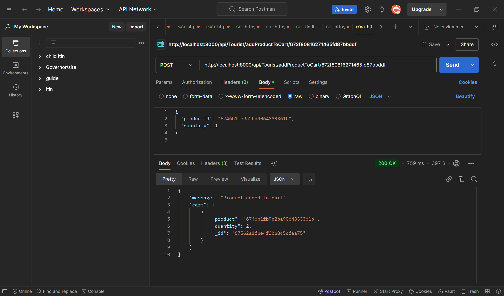
   
2. *Getting Access Token*: 
   - *Function*: Ensures that an access token is successfully retrieved for authenticated API requests.
   - *Proof*: 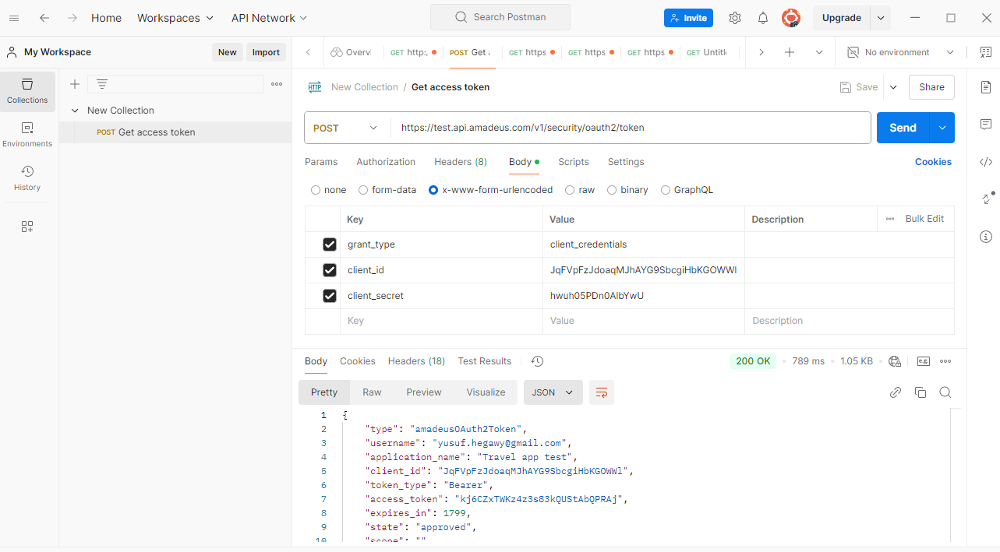

3. *Updating a Completed Itinerary Rating*: 
   - *Function*: Confirms that the rating for a completed itinerary can be successfully updated.
   - *Proof*: 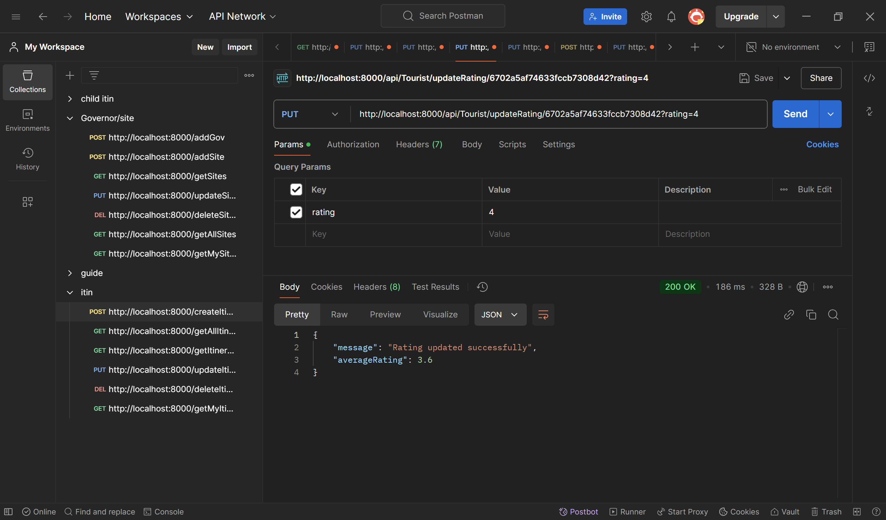

4. *Using the Token to Get Data via API*: 
   - *Function*: Verifies that the API can be accessed using the obtained access token and returns the expected data.
   - *Proof*: 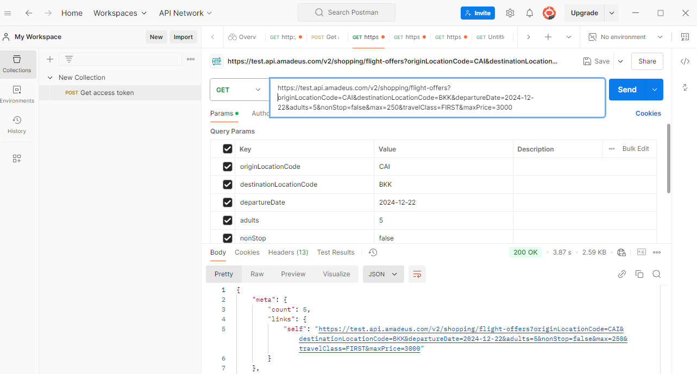

5. *Update Wallet*: 
   - *Function*: Ensures that the user’s wallet balance is updated correctly after transactions.
   - *Proof*: 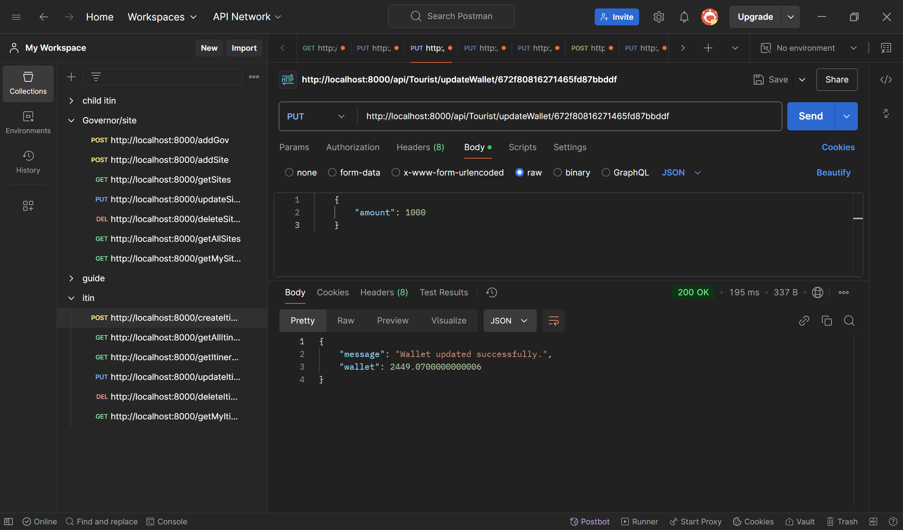

6. *Get Complaints*:
   - *Function*: Gets all the complaints submitted by users for the admin.
   - *Proof*: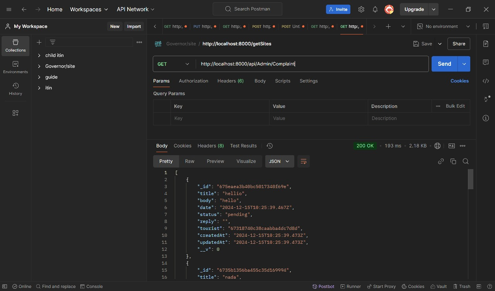

7. *Archive Product*:
   - *Function*: Archives/unarchives a certain product by the admin (ex. in case of no stock).
   - *Proof*: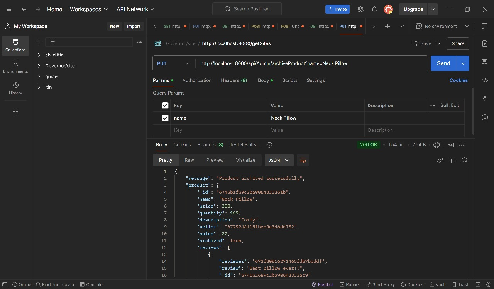

8. *Get All Sites*:
   - *Function*: Gets all the sites to view for the governor.
   - *Proof*: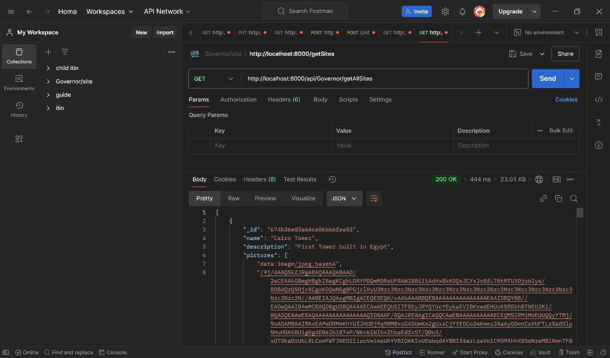

9. *Create Promocode*:
   - *Function*: Creates a promocode by the admin for available users (for itineraries,products,etc..).
   - *Proof*: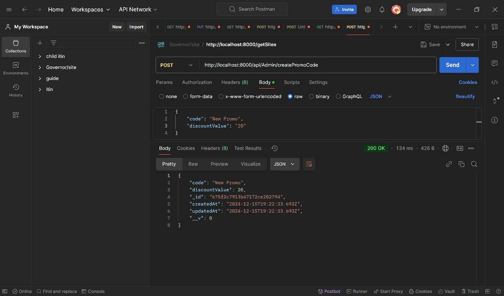

10. *Mark Itinerary Appropriate*:
   - *Function*: admin Marks Itinerary as appropriate for the viewers.
   - *Proof*: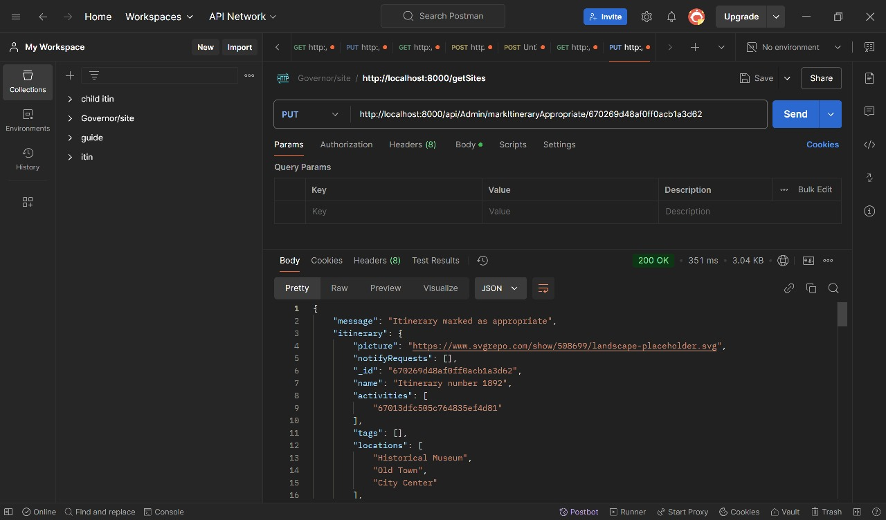

11. *Get Itinerary*:
   - *Function*: Gets itinerary by Id as default for other functions' usage.
   - *Proof*: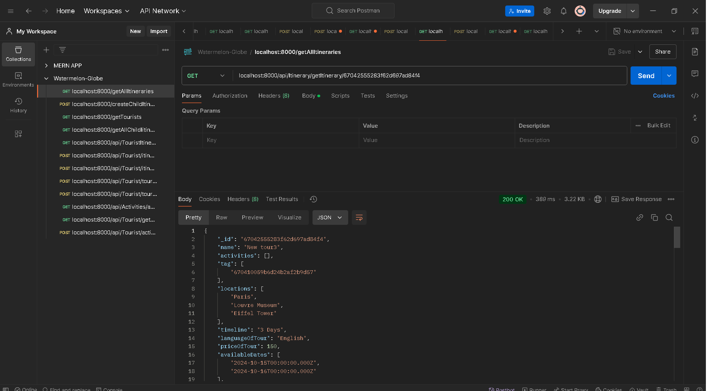

12. *Rate Itinerary*:
   - *Function*: tourist that attended/completed the following itinerary can rate it (out of 5).
   - *Proof*: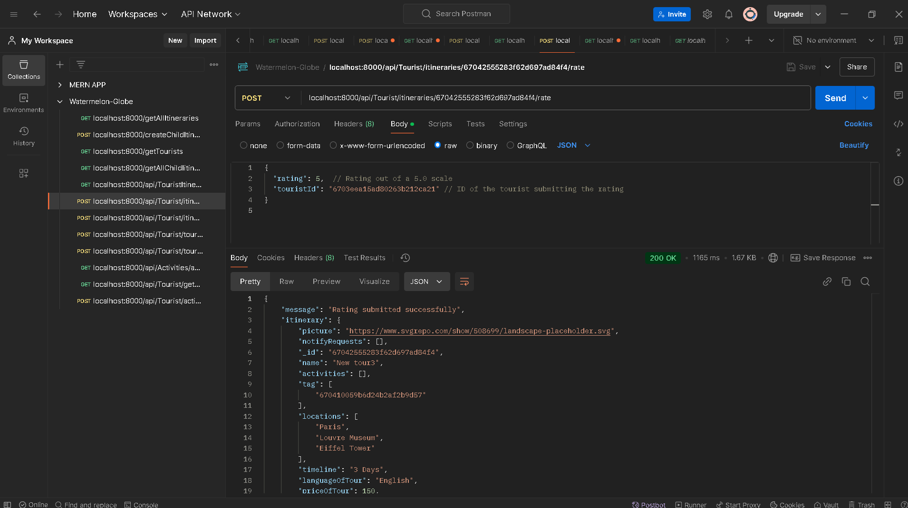

13. *Get All Activities*:
   - *Function*: gets all activities as a default for other functions' usage.
   - *Proof*: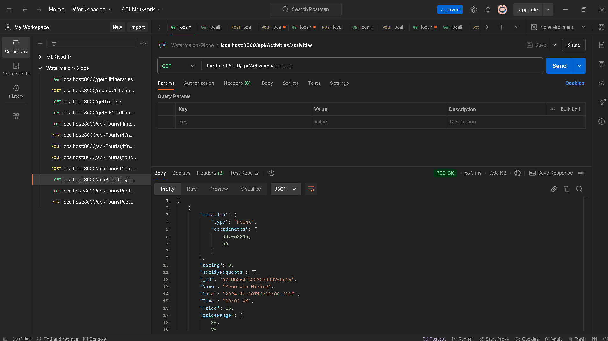

14. *View Attended/Completed Itineraries*:
   - *Function*: tourist can view all their attended/completed itineraries.
   - *Proof*: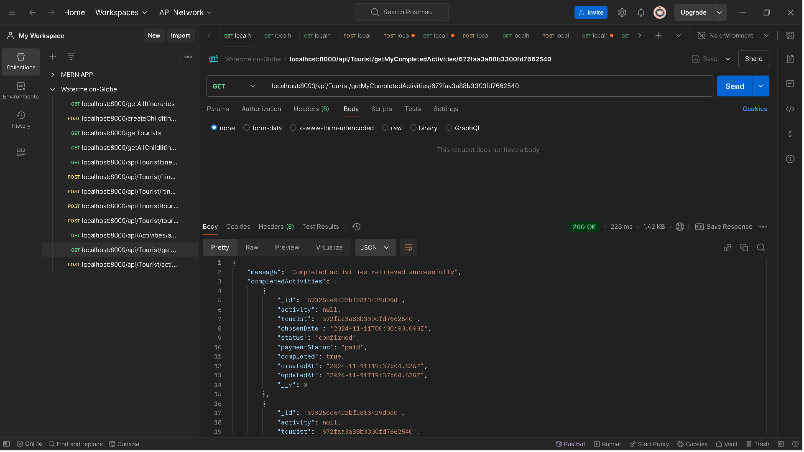

15. *Request account deletion (Tourist)*:
   - *Function*: tourist can view all their attended/completed itineraries.
   - *Proof*: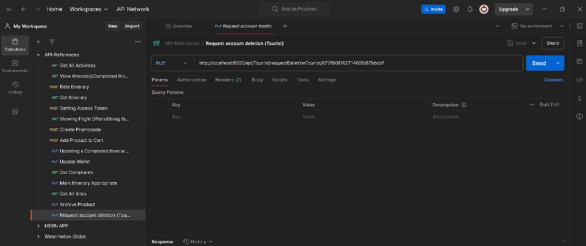

## Test Routes

The provided test routes test the direct API references mentioned on the previous [API References](#API-References) section

### Postman Collection

- *File Name*: API-References.postman_collection.json
- *Description*: Includes all essential API routes, such as:
  - Getting all activities.
  - Viewing completed itineraries.
  - Rating itineraries.
  - Managing user wallets and promotions.
  - Viewing flight offers using Amadeus API.
  - Administrative actions like archiving products or marking itineraries.

### How to Use the Collection

1. Download the Postman collection: [API-References.postman_collection.json](./frontend/src/README/API-References.postman_collection.json)
2. Open Postman and import the collection:
   - Click on *File* > *Import*.
   - Upload the downloaded .json file.
3. Set the required environment variables (if any) for endpoints like Amadeus API.
4. Test each route by selecting it from the collection and sending requests.

### Key Routes in the Collection
- *Get All Activities*: GET localhost:8000/api/Activities/activities
- *View Completed Itineraries*: GET localhost:8000/api/Tourist/getMyCompletedActivities/:touristId
- *Rate Itinerary*: POST localhost:8000/api/Tourist/itineraries/:itineraryId/rate
- *Add Product to Cart*: POST localhost:8000/api/Tourist/addProductToCart/:touristId
- *Flight Offers*: GET https://test.api.amadeus.com/v2/shopping/flight-offers
- *Create Promocode*: POST localhost:8000/api/Admin/createPromoCode
- *Update Wallet*: PUT localhost:8000/api/Tourist/updateWallet/:touristId

For a full list of routes and details, refer to the Postman collection.

## How to Use

Follow these steps to set up the project environment and start the backend and frontend applications:

### Prerequisites

make sure you have downloaded every instance in the [installation section](#Installation)

### Starting the Backend

1. Ensure MongoDB is connected by configuring your .env file with your MongoDB Atlas URI.
2. Start the backend server:
   bash
   nodemon app.js
   

---

### Starting the Frontend

1. Navigate to the React app folder (frontend).
2. Start the React app:
   bash
   npm start
   

---

### Demo Videos

1. *Admin Demo Video*:

  [Click here to watch the demo](https://drive.google.com/file/d/1OXqtEiwnozX3GHcXa_ZTCGBDNR1wcxI2/view?usp=sharing)

2. *Advertiser*:
  
  [Click here to watch the demo](https://drive.google.com/file/d/1F75A9kkPt3Sz3xEdzpZSRMcS5HiiGNRl/view?usp=sharing)

3. *Governor*:

  [Click here to watch the demo](https://drive.google.com/file/d/1aYagdNPnQE4eAFX5j5_6apC1tbF67BF7/view?usp=sharing)

4. *Tour Guide*:

  [Click here to watch the demo](https://drive.google.com/file/d/15GWlJcNoc44s1puJR-JeiHz1FGTULYVX/view?usp=sharing)

5. *Seller*:

  [Click here to watch the demo](https://drive.google.com/file/d/1XPW0FTZLJSDo4pN3I0lqz5BCgPkXqz7Z/view?usp=sharing)

6. *Tourist*:

  [Click here to watch the demo](https://drive.google.com/file/d/1l5zLq0UwpDYJI9XVqSV7KH2gmMVZsZqs/view?usp=sharing)

Your backend will run at http://localhost:8000 (or the port you configure), and the frontend will run at http://localhost:3000.

## Contribute

We welcome contributions from everyone! Whether you're fixing a typo, adding a new feature, or optimizing our code, your help is appreciated. Here's how you can contribute:

1. *Fork* the repository
2. *Clone* your fork
3. *Create* a new branch for your feature or fix
4. *Make changes* and write tests
5. *Submit* a Pull Request with a clear description of your changes

### Want to support the Team?

Perfect! Our team is very excited about the chance of securing a job, and we may or may not(wink wink)be running on caffeine and hope. If you want to contribute in a more permanent way, drop us a line(or a job-interview). We might just need your amazing skills (and your willingness to help keep our team from turning into a coffee-drinking zombie crew)!

## Credits

Credits
We would like to extend a huge thank you to the following sources for their resources and inspiration:

 - *Unsplash* – For providing beautiful, high-quality images that enhanced our project.
 - *Dribbble* – For the fantastic design inspirations that guided our visual elements.
 - *YouTube Playlist*: Learn Full Stack Web Development – A series of tutorials that helped shape the backend of our project.
 - *YouTube Video*: Full Stack Development Tutorial – A great resource for understanding core web development concepts.
 - *Mr. ChatGPT* – For providing endless guidance, support, and clever solutions. You rock!
 - *The Amazing and Helpful Engineer Nada Ibrahim (Top el Top)* – For being an incredible mentor and offering invaluable assistance throughout the project.
 
Thank you all for contributing to the open-source community!

## Licenses

This project uses the following licenses:

- *MIT*

- *BSD-2-Clause*

- *Apache 2.0*